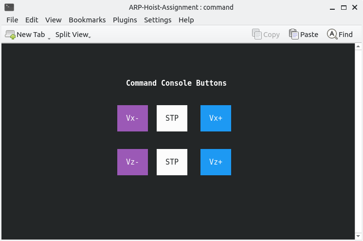
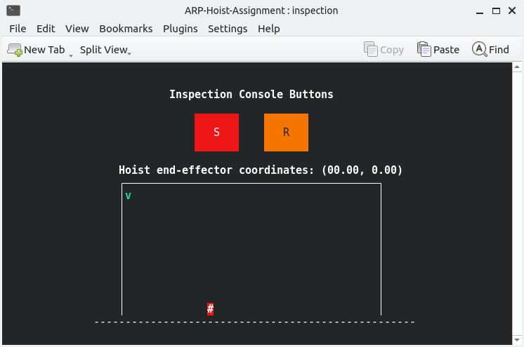
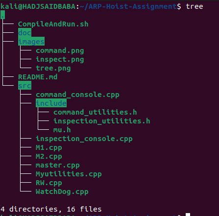

# ARP First assignment
Done By Baba HADJ SAID ID: 5413915
## User Manual and Documentation:
### User Manual:
#### Requirements:
##### ncurses installation
To install the ncurses library, simply open a terminal and type the following command:
```console
sudo apt-get install libncurses-dev
```
#### To Compile and Run the Program:
Browse to the folder containing the project and run the command: 
```console
chmod +x ./CompileAndRun.sh
./CompileAndRun.sh 
```
This command will set-up, Compile and Run the program.
you will then be prompt with Two konsole windows, which are as follows:
##### Command Window:
The hoist is controlled by a command window in which there are 6 buttons:

- **_Vx+_** and **_Vx-_** to increment and decrement the speed along the x-axis
- **_Vz+_** and **_Vz-_** to increment and decrement the speed along the y-axis
- **_STP_** button to set the speed along the corresponding axis to zero



##### Inspect Window:
The position of the hoist is shown on this window in which there are 2 buttons:

- **_S_** (stop) to immediately stops the hoist
- **_R_** (reset) to move back the hoist to the initial position.


#### Additional features:
- The hoist will automatically be reseted if the hoist is not moved for more then 60 seconds.
- During the execution of the program, each process will write information on their log file, located in the `Logs` directory.
### Documentation:
You will find an auto-generated documentation of the code in the doc folder, by running the index.html file.
## Folders tree:

The repository is organized as follows:
- the `src` folder contains all the source code.

- the `src/include` folder contains all the header files.

- the `doc` folder contains all the auto generated files related to the documentation.

After compiling the program other two directories will be created:

- the `bin` folder contains all the executable files
- the `Logs` folder will contain all the log files.

## Processes
The program is composed of 6 processes:
- `master.cpp` is the first process to be executed and it takes care of launching all the other processes. In case one of them terminates unexpectedly it prints the status to the screen, when ctrl+c is pressed the master process will kill all the processes and terminate.
- `command_console.c` creates a window where you can send commands to the two motors, using a ncurses GUI
- `M1.cpp` is the process related to the motor that makes the hoist move in the x-axis and it listens for commands sent by the command window, computes the new x component of the position, and sends the data to `RW.cpp`
- `M2.cpp` does the same thing as `M1.cpp` for the y-axis.
- `RW.cpp` gets the position from the two motors processes and applies a 5% random error to the measurement, to better simulate error accumulations in the real case scenarios, and send the position to the `inspection_console.c` process
- `inspection_console.c` gets the position from the `RW.cpp` process and displays the hoist on a window, using ncurses GUI. 
- `WatchDog.cpp` monitors the execution of the process, if there is no activity for 60s, it resets the hoist position.
## Other Files:
- `Myutilities.cpp` contains all the functions that are common to all processes in one place, to simplify the reading process of the code, and as a way to create an abstraction.
- `mu.h` a header file contains all that is needed for the code to run (the imports,global variables,MACROS,...).
